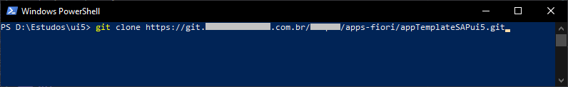
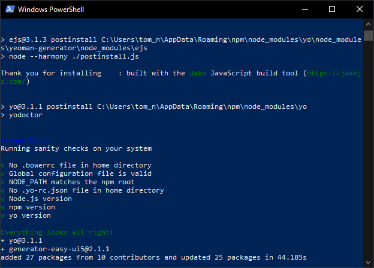
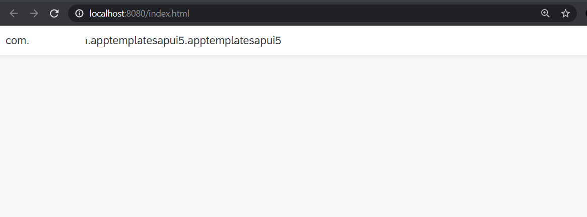
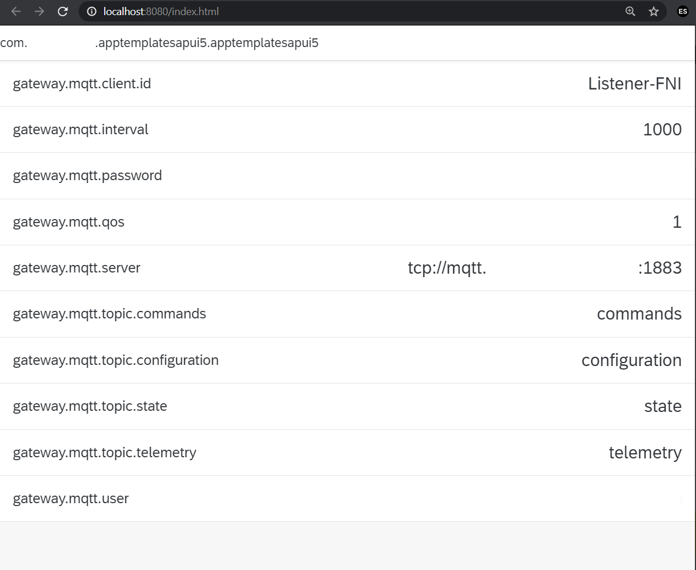

# Procedimento para configuração de ponta a ponta do ambiente de desenvolvimento local

## Objetivo
Esse procedimento visa demostrar passo a passo para preparação do ambiente local para o desenvolvimento de solução SAPui5 localmente.

Pontos:
- Desenvolvimento com uma versão expecifica do SAPui5
- Utilização do oData do servidor (SAP Gateway ou SAP Hana) com autenticação
- Utilizando VS Code com plugins
- Deploy da aplicação no ambiente
---

## Prerequisitos
Para o desenvolvimento local serão necessários instalar no computador:
- <a href='https://code.visualstudio.com/download'>VS Code</a>
- <a href='https://nodejs.org/en/download/'>Node.JS</a>
- <a href='https://git-scm.com/downloads'>Git</a>
- <a href='https://yeoman.io/'>Yeoman</a>
---

## Iniciando a aplicação
Iremos passar pelos passos para o inicio do desenvolvimentode uma aplicação que irá ser executada localmente e que acessar os serviços que estão publicados.

### Git
Crie um repositorio no Git e faça o clone no diretorio de seus projetos.

```
git clone https://github.com/NunesTom/localsapui5.git
```

<p align="center">
  
</p>

### Variaveis de ambiente
Verifique se o npm está configurado nas variaveis de ambiente.
```
%USERPROFILE%\AppData\Roaming\npm
```

<p align="center">
  
</p>

### Gerador de Aplicação
Utilize o gerador de aplicação ui5 do npm <a href='https://www.npmjs.com/package/generator-easy-ui5'>generator-easy-ui5</a>.

```
npm install -g yo generator-easy-ui5
```

<p align="center">
  
</p>

Agora podemos iniciar o aplicativo executando o comando abaixo no CLI do yo.

```
yo easy-ui5
```

<p align="center">
  
</p>

Verifique que está na pasta do projeto no terminal e execute:
```
npm start
```

Esse comando irá iniciar o script definido no packege.json para abrir a aplicação no navegador.

<p align="center">
  
</p>

---
## Instalação de Runtime SAPui5
Para alguns projetos é necessário uma versão expecifica do SAPui5 que desejamos utilizar. para isso utilizaremos a biblioteca <a href='https://www.npmjs.com/package/sapui5-runtime'>SAPui5-Runtime</a>.

```
npm install -D sapui5-runtime
```
<p align="center">
  
</p>

Inclua no arquivo *package.json* a entrada para a versão do runtime que irá utilizar.

```
"sapui5-runtime": {
    "version": "1.76.00"
}
```

Se você escolheu a rede de entrega de conteúdo como parte da configuração do yeoman, precisamos alterar o arquivo index.html para usar alguns recursos locais. Então substitua o sapui5.ondemand.com.

```
  <script
    id="sap-ui-bootstrap"
    src="../resources/sap-ui-core.js"
    data-sap-ui-theme="sap_fiori_3"
    data-sap-ui-resourceroots='{
        "com.firstdecision.apptemplatesapui5.apptemplatesapui5": "./"
    }'
    data-sap-ui-oninit="module:sap/ui/core/ComponentSupport"
    data-sap-ui-compatVersion="edge"
    data-sap-ui-async="true"
    data-sap-ui-frameOptions="trusted">
  </script>
```

---
## Acessando dados de um serviço

Execute os comandos abaixo no terminal para que possamos adicionar recursos locais para consulta serviços não locais. Iremos utilizar um middleware para isso como uma dependencia de desenvolvimento apenas.

```
npm install ui5-middleware-servestatic --save-dev
```
<p align="center">
  
</p>

```
npm install ui5-middleware-proxy-basicauth --save-dev
```

<p align="center">
  
</p>

Agora adicione essas dependencias:

- **"ui5-middleware-servestatic"** : Para utilizar o SAPui5 local
- **"ui5-middleware-proxy-basicauth"**: Funciona como uma destination para o local acessar o serviço em outro local com a autenticação necessária.

E adicione no arquivo *package.json*. Deve ficar assim:

```
"ui5": {
  "dependencies": [
    "ui5-middleware-livereload",
    "ui5-task-nwabap-deployer",
    "ui5-middleware-route-proxy",
    "ui5-middleware-servestatic",
    "ui5-middleware-proxy-basicauth"
  ]
},
```

E mais importante, adicione ao seu arquivo *ui5.yaml* o seguinte:

```
server:
  customMiddleware:
  - name: ui5-middleware-servestatic
    afterMiddleware: compression
    mountPath: /resources
    configuration:
      rootPath: "../sapui5-1.76.1/resources"
  - name: ui5-middleware-proxy-basicauth
    afterMiddleware: compression
    mountPath: /<caminho a ser acessado localmente>
    configuration:
      baseUri: "<hosto do servidor que será acessado>"
      auth: "<usuário>:<senha>"
```
e verificar a versão do framework.
```
framework:
  name: SAPUI5
  version: 1.76.0
  libraries:
    - name: sap.ui.core
    - name: sap.m
    - name: sap.ui.layout
    - name: themelib_sap_fiori_3
```

No arquivo *manifest.json*, adicionar no datasource para a aplicação poder acessar as informações:

```
"dataSources": {
  "mainService": {
    "uri": "/<caminho mountPath no ui5.yaml>/<caminho do serviço a ser acessado>",
    "type": "OData",
    "settings": {
      "odataVersion": "2.0",
      "localUri": "localService/metadata.xml"
    }
  }
},
```

Agora atribua o dataSource adicionado a um modelo no arquivo *manifest.json*.
```
"": {
  "dataSource": "mainService",
  "settings": {
    "metadataUrlParams": {
      "sap-documentation": "heading"
    },
    "defaultBindingMode": "TwoWay"
  }
}
```

Para ver a consulta funcionar adicione uma lista simples na view principal da aplicação. Preste a atenção se vc colocou nome no modelo para coloca-lo no path da consulta na view.

```
<List
  id="list"
  items="{
    path: '/Parameter'
  }"
  busyIndicatorDelay="{masterView>/delay}"
  noDataText="{masterView>/noDataText}"
  mode="{= ${device>/system/phone} ? 'None' : 'SingleSelectMaster'}"
  growing="true"
  growingScrollToLoad="true">
  <items>
    <ObjectListItem
      type="{= ${device>/system/phone} ? 'Active' : 'Inactive'}"
      title="{DS_PARAMETER_KEY}"
      number="{DS_PARAMETER_VALUE}">
    </ObjectListItem>
  </items>
</List>
```

Execute novament o serviço no npm:

```
npm run start
```

Pronto, dados estão sendo apresentados:
<p align="center">
  
</p>

---
## Deploy de aplicações no SAP Gateway

BREVE

---
## Testes Automaticos

BREVE

---
## Debugando SAPui5

BREVE

---
#### Fontes:
- <a href='https://blogs.sap.com/2019/11/24/ui5-tooling-custom-task-to-deploy-ui5-sources-to-an-abap-server/'>UI5 Tooling Custom Task to deploy UI5 sources to an ABAP server</a>
- <a href='https://www.npmjs.com/package/ui5-middleware-proxy-basicauth'>ui5-middleware-proxy-basicauth</a>
- <a href='https://blogs.sap.com/2018/08/01/ci-cd-for-sapui5-on-abap-with-gitlab/'>CI / CD for SAPUI5 on ABAP with GitLab</a>
- <a href='https://blogs.sap.com/2019/11/05/end-to-end-setup-of-local-development-environment-with-ui5-tooling/'>Configuração de ponta a ponta do ambiente de desenvolvimento local com o UI5 Tooling</a>
- <a href='https://blogs.sap.com/2019/05/22/debugging-a-single-js-file-in-sapui5/'>Debugging a single JS file in SAPUI5</a>
- <a href='https://blogs.sap.com/2019/12/03/server-side-code-coverage-for-sapui5/#'>Server side code coverage for SAPUI5</a>
- <a href='https://www.youtube.com/channel/UCoC8ZA73dF5FpNw1NLXYf4g/videos'>UI5 Community Network</a>

#### Fontes de Curiosidades
- <a href='https://blogs.sap.com/2020/04/14/covid-19-sap-cloud-platform/'>COVID-19 SAP Cloud Platform</a>
-
